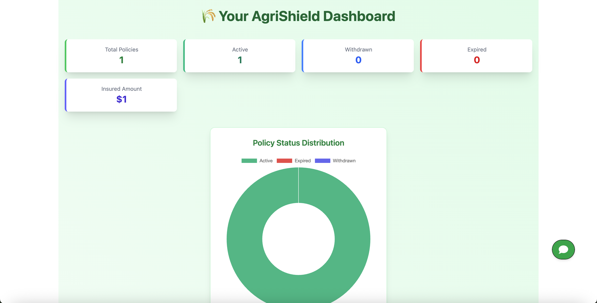
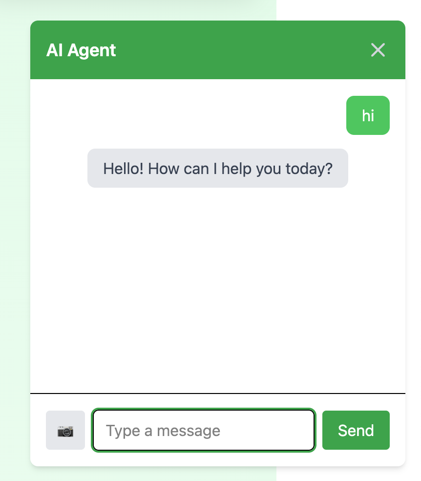
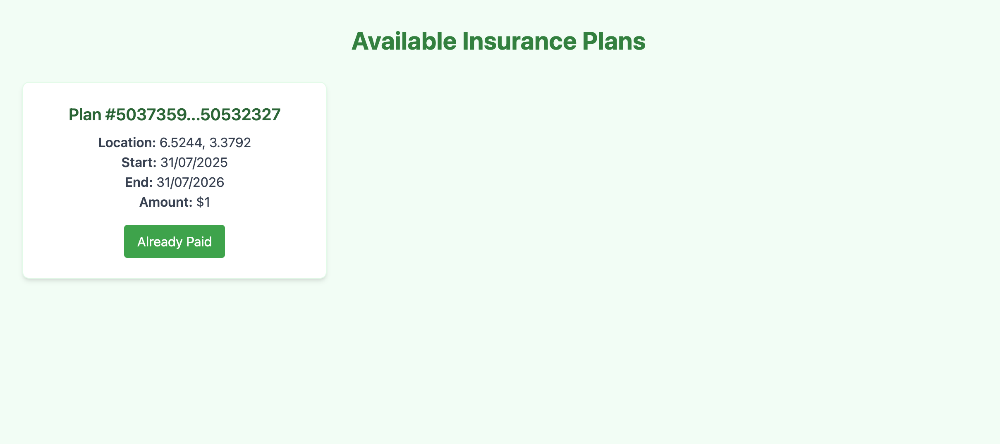
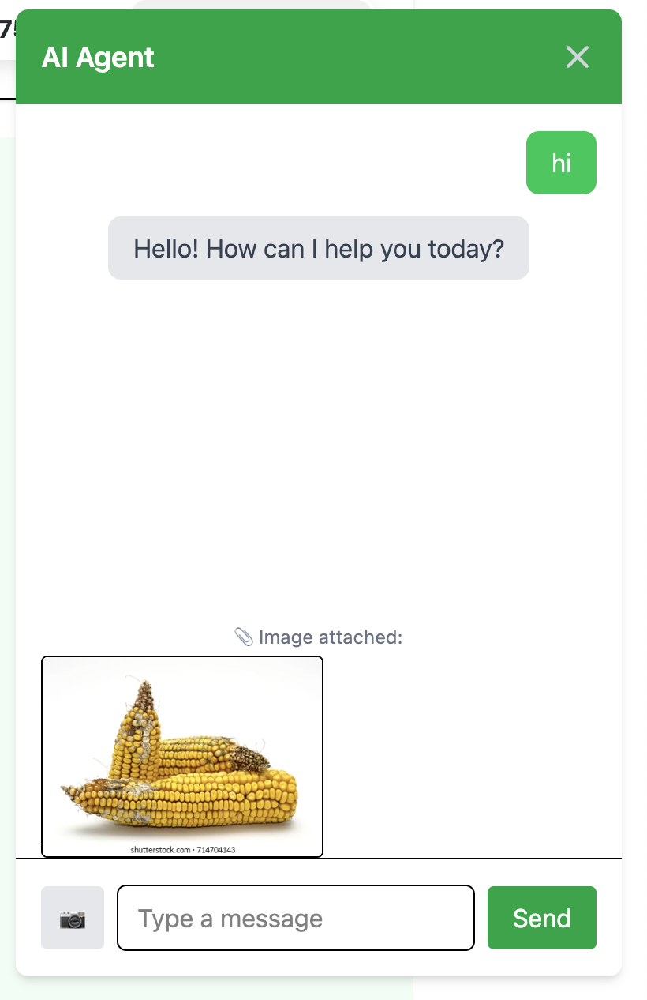

# 🌾 AgriShield

**AgriShield** is a decentralized crop insurance platform that helps farmers protect their livelihoods against climate risks such as drought and excess rainfall. It uses satellite-monitored weather data and smart contracts to automate insurance coverage, claims, and payouts — reducing friction, fraud, and delays in traditional agricultural insurance.

---

## 🧠 Problem Definition & Context

Smallholder farmers are disproportionately affected by climate change. In regions where access to traditional insurance is limited or non-existent, farmers face devastating financial loss after extreme weather events.

### Challenges:

- Traditional insurance is slow, manual, and opaque.
- High administrative overhead and fraud risks.
- Farmers lack tools to validate or claim compensation independently.

AgriShield was created to solve this by offering **weather-indexed, smart contract-backed insurance**, triggered by **real-time weather data**, with **AI-assisted interaction** for seamless user experience.

---

## 🔒 Identified Constraints

| Constraint      | Details                                                            |
| --------------- | ------------------------------------------------------------------ |
| ⚡ Power        | Designed to work in low-power, mobile-first environments           |
| 📶 Connectivity | Fallback support via low-bandwidth UIs and lightweight APIs        |
| 🧮 Compute      | AI logic offloaded to cloud (OpenAI), smart contracts run on-chain |
| 📡 Data         | Relies on minimal weather API calls + optional satellite data      |

---

## 🧪 Functional Demo

**🚀 Live URL:** [https://agrishield-pi.vercel.app/](https://agrishield-pi.vercel.app/)

> Demo includes:
>
> - Plan selection
> - Onboarding simulation
> - Weather-triggered contract logic
> - Chat-based AI interaction

---

## 🧰 Tools Used

| Technology                  | Reason for Choice                                                          |
| --------------------------- | -------------------------------------------------------------------------- |
| 🧠 **GPT-4o**               | Vision + prompt support for natural interaction and image claim submission |
| 🌐 **React + Tailwind**     | Fast, mobile-responsive UI                                                 |
| 🔗 **Solidity + Ethers.js** | Smart contracts for automation and transparency                            |
| ☁️ **Open-Meteo API**       | Free, high-resolution weather data                                         |
| 🛠️ **LangChain**            | Agent orchestration and prompt tooling                                     |
| 🧪 **Vercel**               | Easy CI/CD deployment                                                      |
| 🌍 **IPFS** _(optional)_    | For decentralized claim/image storage                                      |

---

## 💡 Design Alternatives & Decisions

| Decision Area     | Final Choice                    | Alternatives Considered                           |
| ----------------- | ------------------------------- | ------------------------------------------------- |
| Weather source    | Open-Meteo API                  | OpenWeatherMap, NOAA, proprietary satellite feeds |
| AI architecture   | GPT-4o + LangChain              | Local LLMs, basic rule engines                    |
| Insurance trigger | Smart contract + weather oracle | Manual confirmation, government intermediaries    |
| UX flow           | AI bot + form-based fallback    | Traditional form-only or call-center support      |

---

## 🧪 Performance & Tests

| Component           | Metric                       | Result                  |
| ------------------- | ---------------------------- | ----------------------- |
| 🌤️ Weather Fetch    | Avg. API latency             | \~210ms                 |
| 📄 Contract deploy  | Polygon testnet              | < 5s                    |
| 🧠 AI Response      | GPT-4o chat + tool call      | \~1.5s                  |
| 🖼️ Image processing | Base64 + agent handoff       | Supported               |
| 🧪 Claim simulation | Time to trigger payout logic | \~8s from weather check |

---

## 📸 Screenshots

### 🌤️ Dashboard View



### 🤖 AI Chatbot UI



### 🧾 Plan Selection Page



### 📷 Image Upload Flow



---

## 🚀 Features

- ✅ Weather-indexed insurance for farmers
- ✅ Automatic payouts triggered by satellite/weather data
- ✅ AI assistant (chat-based) for onboarding, Q\&A, and image-based claims
- ✅ Smart contract-backed transparency and auditability
- ✅ Clean, responsive UI with React + Tailwind CSS

---

## 📦 Tech Stack

- **Frontend:** React, TypeScript, Tailwind CSS
- **Blockchain:** Solidity smart contracts (Flare Coston2)
- **Web3 Integration:** Ethers.js
- **Weather Monitoring:** Open-Meteo API (with Flare FDC)
- **AI:** GPT-4o via LangChain
- **Deployment:** Vercel (demo), IPFS (optional for decentralized storage)

---

## 📄 Smart Contract Snippet

```solidity
struct InsurancePlan {
    uint256 id;
    uint256 latitude;
    uint256 longitude;
    uint256 startDate;
    uint256 endDate;
    uint256 amountInUsd;
}

function payForPolicy(uint256 planId, address token) public payable;
```

---

## 🛠️ Running Locally

```bash
git https://github.com/Imdavyking/AgriShield
cd AgriShield/frontend
npm install
npm run dev
```

---

## 📍 What’s Next

- 🔗 Full Chainlink Oracle integration for verified weather triggers
- 📷 AI claim assistant with satellite-based crop damage assessment
- 📱 Mobile-first UI + offline mode
- 🧾 Farmer wallet notifications for claim status and payouts
- 🌐 Localization support for rural/global rollout

---

## 🤝 Contributing

Pull requests are welcome. For major changes, please open an issue first to discuss the proposal.

---

## 🛡️ License

MIT License © 2025 AgriShield Team
